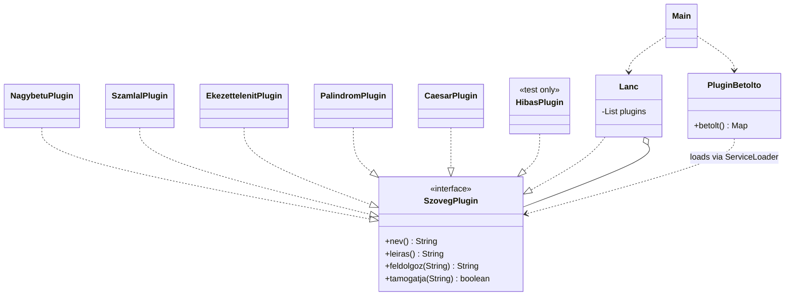

# UML class diagram

```mermaid
classDiagram
    class SzovegPlugin {
        <<interface>>
        +nev() String
        +leiras() String
        +feldolgoz(String) String
        +tamogatja(String) boolean
    }
    class PluginBetolto {
        +betolt() Map
    }
    class Lanc {
        -List plugins
    }
    class Main
    class NagybetuPlugin
    class SzamlalPlugin
    class EkezettelenitPlugin
    class PalindromPlugin
    class CaesarPlugin
    class HibasPlugin {
        <<test only>>
    }

    NagybetuPlugin ..|> SzovegPlugin
    SzamlalPlugin ..|> SzovegPlugin
    EkezettelenitPlugin ..|> SzovegPlugin
    PalindromPlugin ..|> SzovegPlugin
    CaesarPlugin ..|> SzovegPlugin
    HibasPlugin ..|> SzovegPlugin
    Lanc ..|> SzovegPlugin
    Lanc o-- SzovegPlugin
    PluginBetolto ..> SzovegPlugin : loads via ServiceLoader
    Main ..> PluginBetolto
    Main ..> Lanc
```